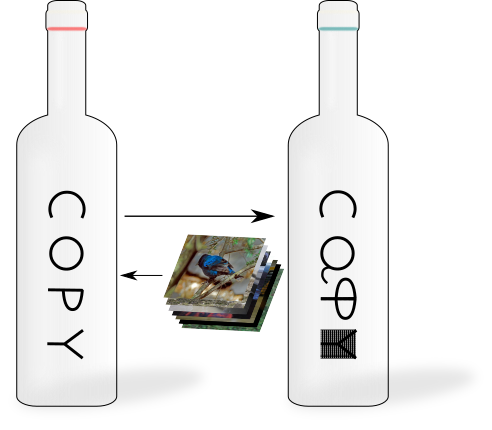

<p align="center">
  
  <h2 align="center">Copycat CNN</h2>
</p>

#### Is your model safe or can I _Copycat_ it? *its answer is the way to steal its knowledge!*

In the past few years, Convolutional Neural Networks (CNNs) have been achieving state-of-the-art performance on a variety of problems.
Many companies employ resources and money to generate these models and provide them to users around the world, therefore it is in their best interest to protect them, i.e., to avoid that someone else copy them.
Several studies revealed that state-of-the-art CNNs are vulnerable to adversarial examples attacks, and this weakness indicates that CNNs do not need to operate in the problem domain.
<br>Therefore, we hypothesize that they also do not need to be trained with Problem Domain images to operate on it, i.e., we can query a black-box model with [ImageNet's](https://image-net.org/) images and use the provided labels (hard-labels) to train a new model (*called Copycat*) that achieves similar performance on test dataset.

This simple method to attack a model and steal its knowledge is our scope of research and you can learn more at:
[Paper 1](http://dx.doi.org/10.1109/ijcnn.2018.8489592) ([arXiv](https://arxiv.org/abs/1806.05476)),
[Paper 2](http://dx.doi.org/10.1016/j.patcog.2021.107830) ([arXiv](https://arxiv.org/abs/2101.08717)), and
[Papers' code](https://github.com/jeiks/Stealing_DL_Models).
In these works, our experiments presented high accuracies, showing that is possible to copy a black-box model.
As cited before, the process uses only Random Natural images (i.e., images from [ImageNet](https://image-net.org/) and some from [Microsoft COCO](https://cocodataset.org)) labeled (hard-label) by target model.
The main difference between our work and others is that we only use the hard-labels, i.e., it is not necessary to know the *probabilities* (logits) of the target model, only the classification label for each image.

Our experiments were initially developed using [Caffe Framework](https://caffe.berkeleyvision.org/), but to be easy to you, we provide an [example of usage](https://github.com/jeiks/Stealing_DL_Models/tree/master/Framework) implemented in PyTorch to you test and apply _Copycat_.

We are currently continuing our research using [PyTorch](https://pytorch.org/). Our own Framework is constantly under development (and lacks documentation), but we are publishing it to provide a simple way to test the Copycat method on your data.

    @inproceedings{Correia-Silva-IJCNN2018,
      author={Jacson Rodrigues {Correia-Silva} and Rodrigo F. {Berriel} and Claudine {Badue} and Alberto F. {de Souza} and Thiago {Oliveira-Santos}},
      booktitle={2018 International Joint Conference on Neural Networks (IJCNN)},
      title={Copycat CNN: Stealing Knowledge by Persuading Confession with Random Non-Labeled Data},
      year={2018},
      pages={1-8},
      doi={10.1109/IJCNN.2018.8489592},
      ISSN={2161-4407},
      month={July}
    }

    @article{Correia-Silva-PATREC2021,
	  author={Jacson Rodrigues {Correia-Silva} and Rodrigo F. {Berriel} and Claudine {Badue} and Alberto F. {De Souza} and Thiago {Oliveira-Santos}},
	  title={Copycat CNN: Are random non-Labeled data enough to steal knowledge from black-box models?},
	  journal={Pattern Recognition},
	  volume={113},
	  pages={107830},
	  year={2021},
	  issn={0031-3203}
    }

Feel free to contact me (jacson.silva at ufes dot br) and also to contribute with us.

### My Thesis

My last work was my Doctoral Thesis, which can be found at:<br>
[Copycat CNN: Convolutional Neural Network Extraction Attack with Unlabeled Natural Images](https://sappg.ufes.br/tese_drupal//tese_17166_Tese-Jacson-2018142921.pdf)
([2nd download option](https://drive.google.com/file/d/1ceLIJOvPMyRc2IN5hkE3-Ncgp4PxM6wQ/view?usp=sharing))

The code provided here was used in a part of the experiments of my thesis, and
[the PyTorch Weights for Oracle and Copycat models can be downloaded here](https://drive.google.com/drive/folders/1t1yANSFisafcLRtt3ibTUp81RF1I2NzP?usp=drive_link).

Due to the copyrights restrictions, I cannot provide the datasets, but feel free to contact me for support in generating them.

    @phdthesis{correia-silva-phd-2023,
        author = {Correia-Silva, Jacson Rodrigues},
        title = {Copycat CNN: Convolutional Neural Network Extraction Attack with Unlabeled Natural Images},
        year = {2023},
        school = {Universidade Federal do Esp\'{i}rito Santo},
        address = {Esp\'{i}rito Santo, Brazil},
    }

### How to use your own data to train a Oracle and to attack it using Copycat method

Clone the Copycat's repository:
```sh
git clone https://github.com/jeiks/copycat_framework.git
cd copycat_framework
# creating a data folder:
mkdir data
```

Inside the "data" folder (created with ```mkdir data``` command), create three files related to your data:
 - *train.txt*: images to train Oracle.
 - *test.txt*: images to test the Oracle and the Copycat.
 - *npd.txt*: images from ImageNet (to attack the problem). It will be used to query Oracle and to train Copycat.
 - *pd_sl.txt*: images from the same problem domain. It will be used to query Oracle and finetune the Copycat.

Note: use image's absolute path to make it easier. Example: */media/Data/MY_PROBLEM/train/image_01*

The contents of the *train.txt* and the *test.txt* files must provide two space-separated columns. The first column must provide the absolute path of the image and the second column must provide the label.
The *npd.txt* and the *pd_sl.txt* files must provide only the first column with the absolute path of the image.

Now you have to edit the file [copycat_framework/copycat/config.yaml](copycat/config.yaml) to add dataset information.
Note that if you don't provide all the required configuration, the default configuration will be used for your issue:
```yaml
#Just an example, check the file config.yaml to see the current configuration
default:
    gamma: 0.3
    lr: 1e-4
    criterion: CrossEntropyLoss
    optimizer: SGD
    validation_step: 1
    save_snapshot: true
    weight_decay: true
    oracle:
        max_epochs: 10
        batch_size: 32
    copycat:
        max_epochs: 20
        batch_size: 32
        balance_dataset: 1
    finetune:
        max_epochs: 20
        batch_size: 32
        balance_dataset: 1
...
```
If you are not familiar with YAML, please read its [documentation](https://yaml.org/spec/1.1/#id857168).

Continuing, to add the dataset configuration, you need to create a problem (ex: MY_PROBLEM) and set the values following this example:
```yaml
problem: #add your problem inside this scope
    # your problem name:
    MY_PROBLEM:
        # problem's classes:
        classes: [zero, one, two, three, four, five, six, seven, eight, nine]
        # number of classes:
        outputs: 10
        # TEST DATASET NAME (for all models):
        db_test: test
        # oracle's options:
        oracle:
            # epochs to train the model:
            max_epochs: 5
            # batch size:
            batch_size: 32
            # learning rate:
            lr: 1e-3
            # multiplicative factor of learning rate decay. See details at copycat/utils.py:110-120
            gamma: 0.3
            # TRAIN DATASET NAME TO ORACLE
            db_train: train
        # copycat's options:
        copycat:
            # epochs to train the model:
            max_epochs: 5
            # batch size:
            batch_size: 32
            # learning rate:
            lr: 1e-3
            # multiplicative factor of learning rate decay. See details at copycat/utils.py:110-120
            gamma: 0.3
            # TRAIN DATASET NAME TO COPYCAT
            db_train: npd
        # options to finetune the copycat:
        finetune:
            # epochs to train the model:
            max_epochs: 5
            # batch size:
            batch_size: 32
            # learning rate:
            lr: 1e-3
            # multiplicative factor of learning rate decay. See details at copycat/utils.py:110-120
            gamma: 0.3
            # TRAIN DATASET NAME TO FINETUNE THE COPYCAT
            db_train: pd_sl
        data:
            # here you have to add information about your data.
            # As we chose to put these files in the "data" folder, here we have "data/name"
            # you can bzip2 the files or leave them as a plain text file
            datasets:
                #file content with two space-separated columns: absolute_image_path label
                train: data/train.txt
                #file content with two space-separated columns: absolute_image_path label
                test: data/test.txt
                #file content with one column: absolute_image_path
                npd: data/npd.txt
                #file content with one column: absolute_image_path
                pd_sl: data/pd_sl.txt
            # measures to use in the oracle training
            measures:
                #mean of the training dataset
                mean: [0.1307, 0.1307, 0.1307]
                #standard deviation of the training dataset
                std: [0.2819, 0.2819, 0.2819]
```
If you do not know the mean and std of your problem, use the following script:
```sh
python compute_mean_std.py data/train.txt
```

> If you do not want to edit the original config file, you can copy it to another directory and use the ```--config-file``` option to replace it with your own config file. Example:
> ```python main.py --config-file my_config.yaml```

Now, you can run the following command to train Oracle, Copycat and Fintune the Copycat:
```sh
python main.py -p MY_PROBLEM
```
The Finetuning will load the Copycat model and finetune it with Problem Domain images labeled by the Oracle. It will generate another model: **Finetune.pth**.
<br>If you do not want to Finetune the copycat, you must set the option ```--dont-train-finetune``` to do not train the Finetune model:
```sh
python main.py -p MY_PROBLEM --dont-train-finetune
```

A summary will be displayed to you check the configuration. Example:
```sh
Options:
  Problem: MY_PROBLEM
  Oracle:
     Model filename: 'Oracle.pth'
     Maximum training epochs: 2
     Batch size: 32
     Learning Rate: 0.0001
     Gamma: 0.1
     Dataset: train ('data/train.txt')
  Copycat:
     Model filename: 'Copycat.pth'
     Maximum training epochs: 5
     Batch size: 32
     Learning Rate: 0.0001
     Gamma: 0.3
     Dataset: train ('data/train.txt')
     The dataset will be balanced.
     The training dataset will be labeled by the Oracle Model.
  Copycat Finetuning:
     Model filename: 'Finetune.pth'
     Maximum training epochs: 5
     Batch size: 32
     Learning Rate: 0.0001
     Gamma: 0.3
     Dataset: pd_sl ('data/pd_sl.txt')
     The dataset will be balanced.
     The training dataset will be labeled by the Oracle Model.


  Validation Steps: 1
  A snapshot of the model will be saved for each validation step.

The model will be trained on 'NVIDIA GeForce GTX 1060'


Check the parameters and press ENTER to continue...
```
Now, press ENTER and wait for training process.

If everything goes well, the following models will be generated: **Oracle.pth**, **Copycat.pth**, **Finetune.pth**.

During the training process, the confusion matrix and the metrics will be reported to you for each model. Example:
```sh
Metrics:
Confusion Matrix:
          0    1    2    3    4    5    6    7    8    9
   0:   973    0    4    0    0    0    3    0    0    0
   1:     0 1118    4    0    1    0    7    4    1    0
   2:     1    0 1018    3    0    1    2    6    1    0
   3:     0    0    4  996    0    4    0    3    3    0
   4:     0    1    5    0  955    0    1    6    2   12
   5:     1    0    2    5    1  877    2    2    1    1
   6:     2    0    6    0    0    2  945    0    3    0
   7:     0    1    2    2    2    0    0 1016    1    4
   8:     1    0    1    0    0    0    0    0  971    1
   9:     1    0    5    1    2    1    0    6    9  984
--------------------------------------------------------
              precision    recall  f1-score   support

           0   0.993871  0.992857  0.993364       980
           1   0.998214  0.985022  0.991574      1135
           2   0.968601  0.986434  0.977436      1032
           3   0.989076  0.986139  0.987605      1010
           4   0.993757  0.972505  0.983016       982
           5   0.990960  0.983184  0.987057       892
           6   0.984375  0.986430  0.985401       958
           7   0.974113  0.988327  0.981169      1028
           8   0.978831  0.996920  0.987792       974
           9   0.982036  0.975223  0.978618      1009

    accuracy                       0.985300     10000
   macro avg   0.985384  0.985304  0.985303     10000
weighted avg   0.985401  0.985300  0.985310     10000
-----------------------------------------------------
Accuracy    Macro Average: 0.985304
Accuracy F1-Macro Average: 0.985303


Done (Sat May 14 18:37:43 2022)
```

And at the end of the entire training process, a report comparing the models will be displayed:
```sh
Accuracy (Macro F1-Score):
  Oracle...: 0.995536
  Copycat..: 0.975224
  Finetune.: 0.985303
Attack Performance
  Copycat on Oracle...........: 97.96%
  Finetuned Copycat on Oracle.: 98.97%
```

For each model, you have the option to not train it and also to resume an already trained model.
If you do not train the model and do not provide a trained model, a model with random parameters will be used during the process.
<br>The related options are:

*Oracle*:
* ```--oracle```: filename to save the Oracle model (default: Oracle.pth).
* ```--oracle-resume```: filename to load a trained Oracle model.
* ```--dont-train-oracle```: option to not train a Oracle model.

*Copycat*:
* ```--copycat```: filename to save the Copycat model (default: Copycat.pth).
* ```--copycat-resume```: filename to load a trained Copycat model.
* ```--dont-train-copycat```: option to not train a Copycat model.

*Finetune*:
* ```--finetune```: filename to save the Finetune model (default: Finetune.pth).
* ```--finetune-resume```: filename to load a trained Finetune model.
* ```--dont-train-finetune```: option to not train a Finetune model.

And feel free to email me. I will reply you as soon as possible. =D
